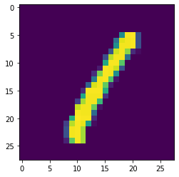

```python
from keras.datasets import mnist
from keras import layers
from keras.layers import *
from keras.models import *
from keras.utils import np_utils
```

    Using TensorFlow backend.
    


```python
(x_train,y_train),(x_test,y_test) = mnist.load_data()
```


```python
x=x_train

import matplotlib.pyplot as plt

plt.imshow(x[3])
plt.show()
```





```python
x_train = x_train.reshape(x_train.shape[0],x_train.shape[1],x_train.shape[2],1)
x_test =x_test.reshape(x_test.shape[0],x_test.shape[1],x_test.shape[2],1)

print('x train shape',x_train.shape)
print('x test shape',x_test.shape)

x_train =x_train.astype('float32')
x_test = x_test.astype('float32')

x_train = x_train/255
x_test = x_test/255

y_train = np_utils.to_categorical(y_train,10)
y_test = np_utils.to_categorical(y_test,10)

print('y train',y_train.shape)
print('y test',y_test.shape)
```

    x train shape (60000, 28, 28, 1)
    x test shape (10000, 28, 28, 1)
    y train (60000, 10)
    y test (10000, 10)
    


```python
model = Sequential()
model.add(Conv2D(25,(3,3),activation='relu'))
model.add(MaxPool2D(1,1))
model.add(Flatten())
model.add(Dense(100,activation='relu'))
model.add(Dense(50,activation='relu'))
model.add(Dense(10,activation='softmax'))
model.compile(loss='categorical_crossentropy', metrics=['accuracy'], optimizer='adam')


model.fit(x_train,y_train,batch_size=128,epochs=10)
    
```

    Epoch 1/10
    60000/60000 [==============================] - 70s 1ms/step - loss: 0.2122 - accuracy: 0.9381
    Epoch 2/10
    60000/60000 [==============================] - 65s 1ms/step - loss: 0.0605 - accuracy: 0.9826
    Epoch 3/10
    60000/60000 [==============================] - 64s 1ms/step - loss: 0.0358 - accuracy: 0.9893
    Epoch 4/10
    60000/60000 [==============================] - 64s 1ms/step - loss: 0.0229 - accuracy: 0.9926
    Epoch 5/10
    60000/60000 [==============================] - 69s 1ms/step - loss: 0.0151 - accuracy: 0.9952
    Epoch 6/10
    60000/60000 [==============================] - 65s 1ms/step - loss: 0.0117 - accuracy: 0.9962
    Epoch 7/10
    60000/60000 [==============================] - 64s 1ms/step - loss: 0.0087 - accuracy: 0.9973
    Epoch 8/10
    60000/60000 [==============================] - 67s 1ms/step - loss: 0.0085 - accuracy: 0.9972
    Epoch 9/10
    60000/60000 [==============================] - 65s 1ms/step - loss: 0.0061 - accuracy: 0.9978
    Epoch 10/10
    60000/60000 [==============================] - 65s 1ms/step - loss: 0.0060 - accuracy: 0.9982
    


    <keras.callbacks.callbacks.History at 0x146c476c9b0>


```python
evall = model.evaluate(x=x_test,y=y_test)
print('loss = ',evall[0])
print('accuracy',evall[1])
```

    10000/10000 [==============================] - 4s 424us/step
    loss =  0.06539911680934256
    accuracy 0.9843000173568726
    


```python
import cv2
file = 'one.png'
image = cv2.imread(file, cv2.IMREAD_GRAYSCALE)
image = cv2.resize(image, (28,28))
image = 255-image  

image = image.astype('float32')
image = image.reshape(1, 28, 28, 1)
image = 255-image
image /= 255
```


```python
pred = model.predict(image)

print(pred.argmax())
```

    1
    


```python
import cv2
capt=cv2.VideoCapture(0)
#fourcc=cv2.Vide
while True:
    d,frame=capt.read()
 
    cv2.imshow("sathish",frame)
    cv2.imwrite("output.png",frame)
    cv2.destroyAllWindows()
    capt.release()
    break

file = 'output.png'
image = cv2.imread(file, cv2.IMREAD_GRAYSCALE)
image = cv2.resize(image, (28,28))
image = 255-image  

image = image.astype('float32')
image = image.reshape(1, 28, 28, 1)
image = 255-image
image /= 255 


pred = model.predict(image)

print(pred.argmax())
```

    5
    


```python

```


```python

```
